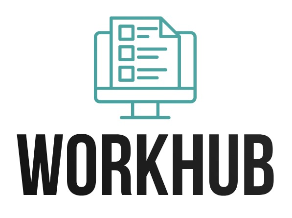

# TAGNOTE

## Descripción

TagNote es una aplicación de gestión de notas diseñada para hacer que tomar, organizar y encontrar notas sea más eficiente y efectivo que nunca. Con una interfaz sencilla y poderosas características, TagNote simplifica la toma de notas y la organización de la información importante en tu vida cotidiana.

## Características Clave

- **Toma de Notas Intuitivas:** TagNote permite crear y editar notas de manera rápida y sencilla. Escribe ideas, pensamientos y recordatorios con facilidad.

- **Categorización Flexible:** Cada nota puede ser etiquetada con una o varias categorías, lo que permite organizar tus notas de acuerdo a tus preferencias personales.

- **Búsqueda:** Encuentra rápidamente las notas utilizando la función de búsqueda avanzada. Busca por título o fecha para acceder a la información que necesitas en segundos.

- **Privacidad y Seguridad:** Todas tus notas son privadas y solo accesibles por ti. TagNote garantiza la seguridad de tus datos personales.

- **Acceso desde Cualquier Lugar:** Puedes acceder a tus notas desde cualquier dispositivo con acceso a internet, lo que te permite mantener tu información sincronizada en todo momento.

- **Interfaz Intuitiva:** Nuestra interfaz de usuario limpia y moderna te permite navegar y gestionar tus notas de manera fácil y rápida.
